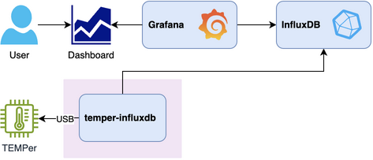
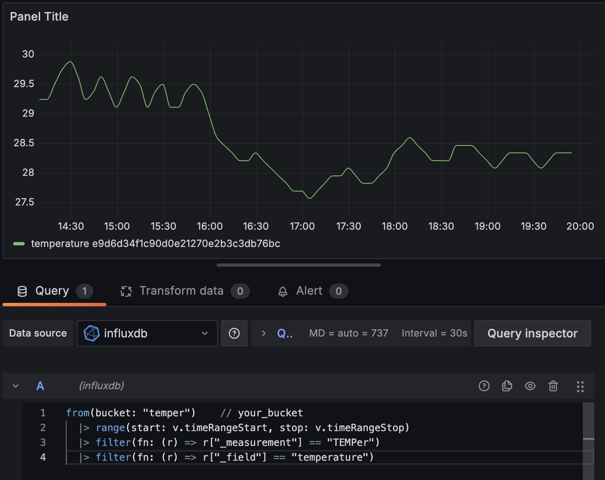

# TEMPer-InfluxDB

Write USB TEMPerature data to InfluxDB

## Overview



## Requirements

- USB TEMPer device ([amazon.com](https://www.amazon.com/dp/B08XLS3GLF/)) ([amazon.co.jp](https://www.amazon.co.jp/dp/B004FI1570/))
- [temper binary](https://github.com/bitplane/temper)

## Usage

Set environmental variables

```sh
export INFLUXDB_URL=http://influxdb:8086
export INFLUXDB_ORG=your_org
export INFLUXDB_BUCKET=your_bucket
export INFLUXDB_TOKEN=your_token
```

Run as daemon

```sh
temper-influx -d
```

or command line options

```sh
$ temper-influxdb --help

usage: main.py [-h] [-d] [-t TIME] [--url URL] [--token TOKEN] [--org ORG] [--bucket BUCKET]

options:
  -h, --help            show this help message and exit
  -d, --daemon          Daemon mode
  -t TIME, --time TIME  Time interval
  --url URL             InfluxDB URL
  --token TOKEN         InfluxDB token
  --org ORG             InfluxDB organization
  --bucket BUCKET       InfluxDB bucket
```

```sh
temper-influx -d --url http://influxdb:8086 --org your_org --bucket your_bucket --token your_token
```

Log message

```sh
[INFO    ] 2024-07-03 09:40:04,014 main Start
[INFO    ] 2024-07-03 09:45:04,845 task Saved: {'device_id': 'FC54F0402DE6', 'device_name': 'TEMPer via temper-host-1', 'device_type': 'TEMPer', 'temperature': '27.696424'}
[INFO    ] 2024-07-03 09:50:05,317 task Saved: {'device_id': 'FC54F0402DE6', 'device_name': 'TEMPer via temper-host-1', 'device_type': 'TEMPer', 'temperature': '27.696424'}
```

## Docker usage

### Create and update .env file

```sh
cp .env.example .env
vi .env
```

### Start TEMPer-InfluxDB service

```sh
docker compose build
docker compose up -d && docker compose logs -f
```

## Grafana Influx query

```sql
from(bucket: "temper")    // your_bucket
  |> range(start: v.timeRangeStart, stop: v.timeRangeStop)
  |> filter(fn: (r) => r["_measurement"] == "TEMPer")
  |> filter(fn: (r) => r["_field"] == "temperature")
```


