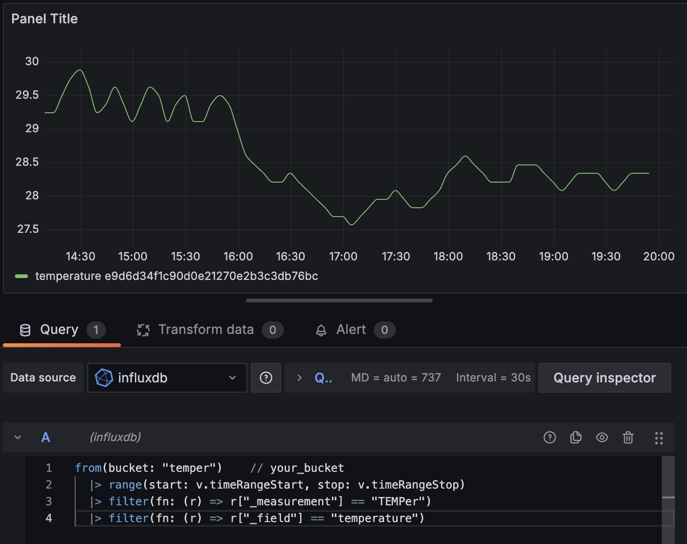

# TEMPer - InfluxDB

Write USB TEMPerature data to InfluxDB

## Requirements

- USB TEMPer device ([amazon.com](https://www.amazon.com/dp/B08XLS3GLF/)) ([amazon.co.jp](https://www.amazon.co.jp/dp/B004FI1570/))
- [temper binary](https://github.com/bitplane/temper)

## Usage

```sh
$ temper-influxdb --help
usage: temper-influxdb [-h] [-d] [-t TIME] [--url URL] [--token TOKEN] [--org ORG] [--bucket BUCKET]

options:
  -h, --help            show this help message and exit
  -d, --daemon          Daemon mode
  -t TIME, --time TIME  Time interval
  --url URL             InfluxDB URL
  --token TOKEN         InfluxDB token
  --org ORG             InfluxDB organization
  --bucket BUCKET       InfluxDB bucket
```

or

```sh
$ export INFLUXDB_URL=http://influxdb:8086
$ export INFLUXDB_ORG=your_org
$ export INFLUXDB_BUCKET=your_bucket
$ export INFLUXDB_TOKEN=your_token

$ temper-influx
```

## Docker usage

### Create and update .env file

```sh
$ cp .env.example .env
$ vi .env
```

### Start TEMPer

```sh
$ docker compose build
$ docker compose up temper -d
```

## Grafana Influx query

```sql
from(bucket: "temper")    // your_bucket
  |> range(start: v.timeRangeStart, stop: v.timeRangeStop)
  |> filter(fn: (r) => r["_measurement"] == "TEMPer")
  |> filter(fn: (r) => r["_field"] == "temperature")
```

